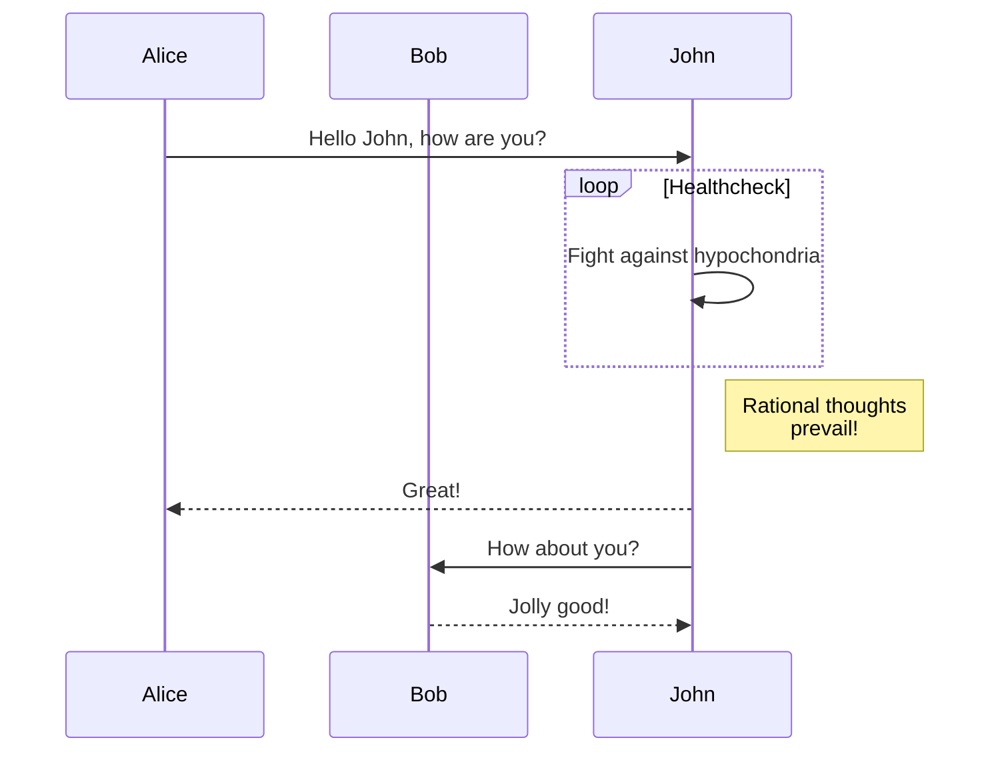

+++
title = 'First Post'
date = 2023-10-29T11:18:19-04:00
draft = false
tags = [test_tag]
categories = [test_category]
+++

# First Post

## H2

### H3

#### H4

##### H5

###### H6

Lorem ipsum dolor sit amet, consectetur adipisici elit

## A Link

[A link](https://en.wikipedia.org/wiki/Lorem_ipsum)

## Table

Col 1 | Col 2 | Col 3
--- | --- | ---
Row 1 | is | here
This | be | row2

## Lists

- Dashed list
  - Indentet
- ...

1. Numbered list
2. goes
3. here

## Code Block Test

```python
from binascii import unhexlify

# comment
b = unhexlify("BAADF00D")
if b != b"\x00":
  print(f"b is {b}")
```

## Highlight Shortcode Test


// GetTitleFunc returns a func that can be used to transform a string to
// title case.
//
// The supported styles are
//
// - "Go" (strings.Title)
// - "AP" (see https://www.apstylebook.com/)
// - "Chicago" (see https://www.chicagomanualofstyle.org/home.html)
//
// If an unknown or empty style is provided, AP style is what you get.
func GetTitleFunc(style string) func(s string) string {
  switch strings.ToLower(style) {
  case "go":
    return strings.Title
  case "chicago":
    return transform.NewTitleConverter(transform.ChicagoStyle)
  default:
    return transform.NewTitleConverter(transform.APStyle)
  }
}


## Mermaid Test




